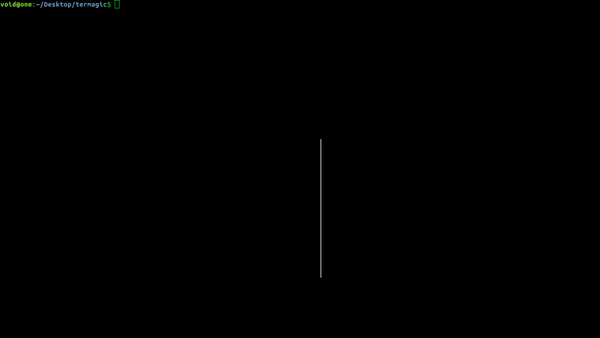

## termagic: use cursor gestures to execute commands



```
usage: magic.py [-h] [--loop] [--exec] [--draw] [--save SAVE] [--daemon]

Execute commands by tracing shapes with your cursor

optional arguments:
  -h, --help   show this help message and exit
  --loop       loop indefinitely, draw an x to exit
  --exec       execute commands immediately
  --draw       draw the recognized shape as ascii image
  --save SAVE  draw the recognized shape as ascii image
  --daemon     run this app in the background
```
